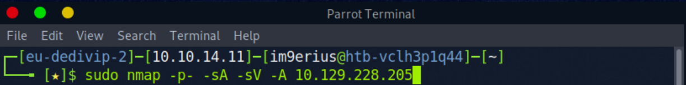
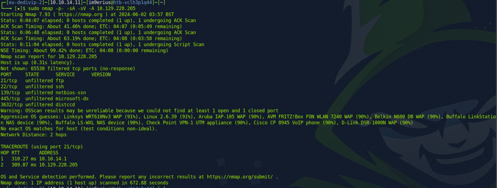
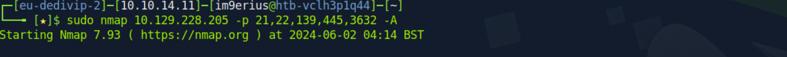
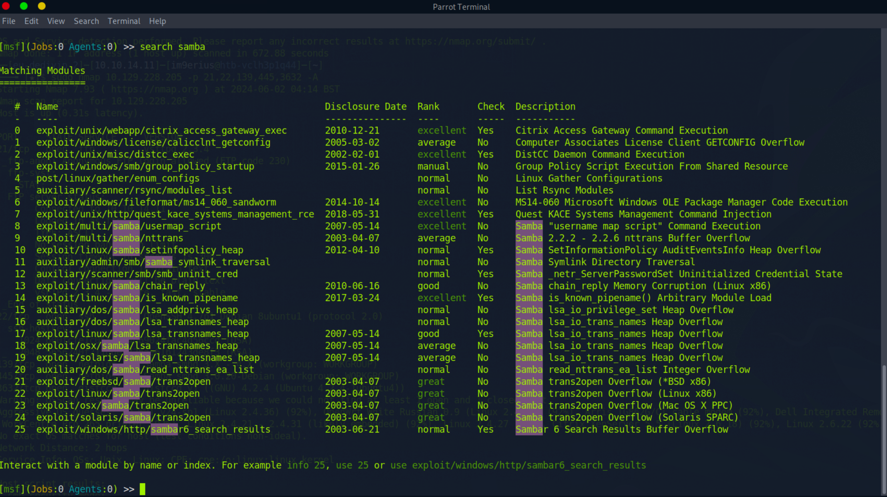
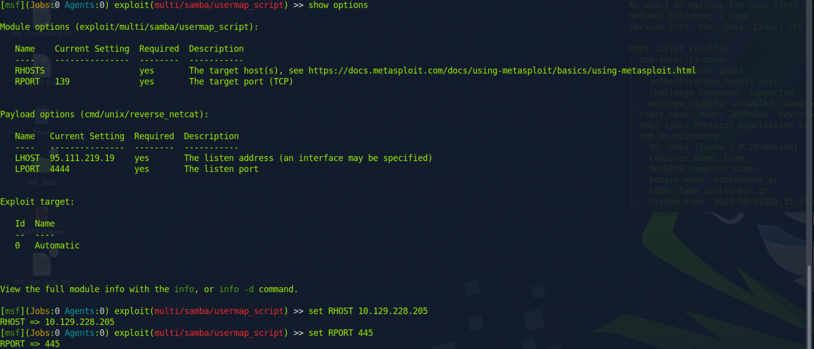
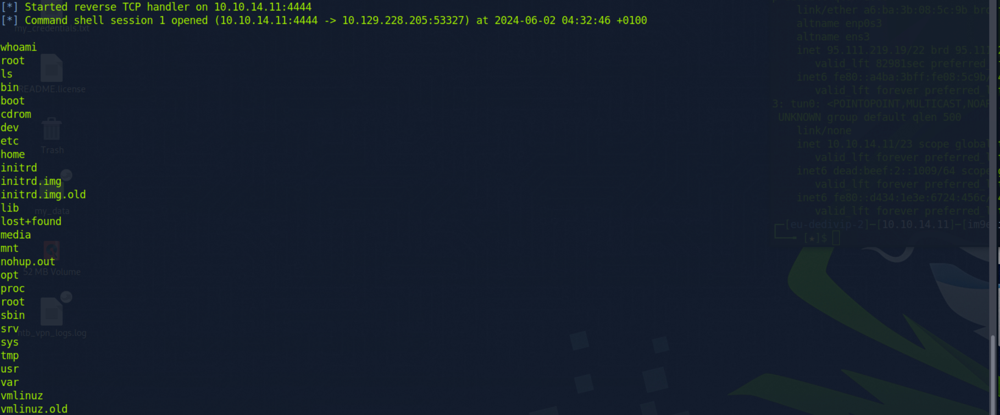
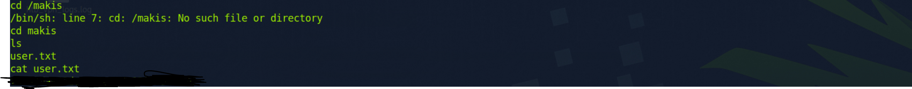

Hello Everyone,

Thank you for taking the time to read my first CTF Walkthrough for the HTB Machine Lame. The following walkthrough will be completed through the Parrot Linux virtual machine. 

First I will be performing an NMAP scan to determine what current services & ports are open. The NMAP flags that will be included in the scan include 
-p- | to scan all ports available
-sA | to perform a TCP ACK-Scan 
-sV | to scan discovered services for their versions 
-A | to detect the current operating system being used

`sudo nmap -p- -sA -sV -A 10.129.228.205`

After the scan completed, it returned the following results 

Based on the results of the following scan we can see that ports 21,22,139,3632 are currently open. We will now complete a specific scan for the following ports to determine what services are running. 

`sudo nmap 10.129.228.205 -p 21,22,139,445,3632 -A`

After the completion of the following scan, we can see a lot more specific information about the services running on the previously identified ports 

Port 445 is currently running Samba smbd and is using the version 3.0.20-Debian, we will now look on Metasploit to determine if there are any vulnerabilities for the following service. 

Based on the following results returned, we will attempt to use the usermap_script exploit to determine if we can gain control of the machine. Based on research the following vulnerability affects Samba 3.0.0 through 3.0.25rc3 and allows remote attacks to execute commands via shell metacharacters. 

I have selected to use the exploit and have made additions to the exploit.

`RHOST set to 10.129.228.205'

'RPORT set to 445'

'LHOST set to 10.10.14.11'

Confirmation has been provided that the exploit has run successfully and I have gained access to the remote pc. 

Through enumeration, I have identified the user directory for Makis, and have uncovered the flag. 

